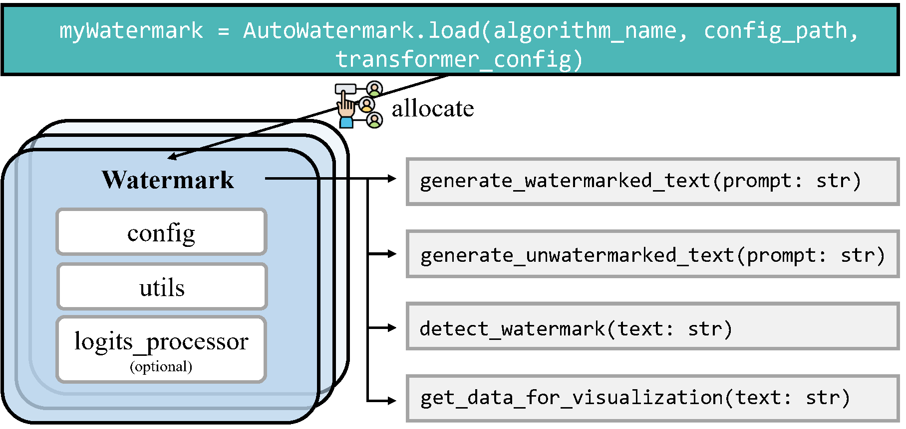
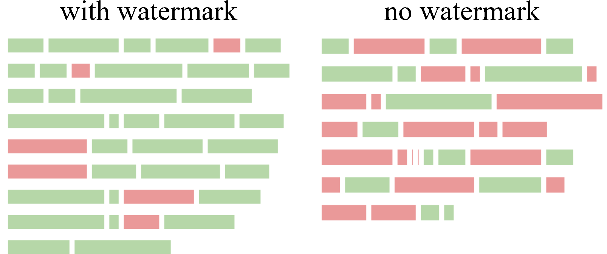
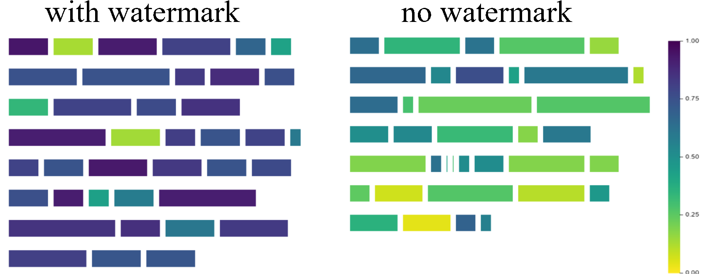

# MarkLLM: An Open-Source Toolkit for LLM Watermarking

> 🎉 **We welcome PRs!** If you have implemented a LLM watermarking algorithm or are interested in contributing one, we'd love to include it in MarkLLM. Join our community and help make text watermarking more accessible to everyone!


<a href="https://2024.emnlp.org/program/demo/" alt="EMNLP 2024 Demo">
    </a>
<a href="https://arxiv.org/abs/2405.10051" alt="arXiv">
    </a>
<a href="https://colab.research.google.com/drive/169MS4dY6fKNPZ7-92ETz1bAm_xyNAs0B?usp=sharing" alt="Colab">
    </a>

### 💡 Some other watermark papers from our team that may interest you ✨

1. [<u>**(ICLR 2024) A Semantic Invariant Robust Watermark for Large Language Models</u>**](https://arxiv.org/abs/2310.06356)
   
   <span style="color:gray">Aiwei Liu, Leyi Pan, Xuming Hu, Shiao Meng, Lijie Wen</span>
   
   [](https://github.com/THU-BPM/Robust_Watermark)
     [](#)

2. [<u>**(ICLR 2024) An Unforgeable Publicly Verifiable Watermark for Large Language Models</u>**](https://arxiv.org/abs/2307.16230)
   
   <span style="color:gray">Aiwei Liu, Leyi Pan, Xuming Hu, Shu'ang Li, Lijie Wen, Irwin King, Philip S. Yu</span>
   
   [](https://github.com/THU-BPM/unforgeable_watermark)
     [](#)

3. [<u>**(ACM Computing Surveys) A Survey of Text Watermarking in the Era of Large Language Models</u>**](https://dl.acm.org/doi/pdf/10.1145/3691626)
   
   <span style="color:gray">Aiwei Liu*, Leyi Pan*, Yijian Lu, Jingjing Li, Xuming Hu, Xi Zhang, Lijie Wen, Irwin King, Hui Xiong, Philip S. Yu</span>
   
   [](https://survey-text-watermark.github.io/)
     [](#)

4. [<u>**(ICLR 2025 Spotlight) Can Watermarked LLMs be Identified by Users via Crafted Prompts?</u>**](https://arxiv.org/abs/2410.03168)
   
   <span style="color:gray">Aiwei Liu, Sheng Guan, Yiming Liu, Leyi Pan, Yifei Zhang, Liancheng Fang, Lijie Wen, Philip S. Yu, Xuming Hu</span>
   
   [](https://github.com/THU-BPM/Watermarked_LLM_Identification)
     [](#)

5. [<u>**(ACL 2025 Main) Can LLM Watermarks Robustly Prevent Unauthorized Knowledge Distillation?</u>**](https://arxiv.org/abs/2502.11598)
   
   <span style="color:gray">Leyi Pan, Aiwei Liu, Shiyu Huang, Yijian Lu, Xuming Hu, Lijie Wen, Irwin King, Philip S. Yu</span>
   
   [](https://github.com/THU-BPM/Watermark-Radioactivity-Attack)
     [](#)

6. [<u>**(NAACL 2025 Findings) WaterSeeker: Pioneering Efficient Detection of Watermarked Segments in Large Documents</u>**](https://arxiv.org/abs/2409.05112)
   
   <span style="color:gray">Leyi Pan, Aiwei Liu, Yijian Lu, Zitian Gao, Yichen Di, Lijie Wen, Irwin King, Philip S. Yu</span>
   
   [](https://github.com/THU-BPM/WaterSeeker)
     [](#)

7. [<u>**(ACL 2024 Main) An Entropy-based Text Watermarking Detection Method</u>**](https://arxiv.org/abs/2403.13485)
   
   <span style="color:gray">Yijian Lu, AIwei Liu, Dianzhi Yu, Jingjing Li, Irwin King</span>
   
   [](https://github.com/luyijian3/EWD)
     [](#)
  
8. [<u>**(ACL 2024 Main) Can Watermarks Survive Translation? On the Cross-lingual Consistency of Text Watermark for Large Language Models</u>**](https://arxiv.org/abs/2402.14007)
   
   <span style="color:gray">Zhiwei He, Binglin Zhou, Hongkun Hao, Aiwei Liu, Xing Wang, Zhaopeng Tu, Zhuosheng Zhang, Rui Wang</span>
   
   [](https://github.com/zwhe99/X-SIR)
     [](#)


### Contents

- [MarkLLM: An Open-Source Toolkit for LLM Watermarking](#markllm-an-open-source-toolkit-for-llm-watermarking)
    - [Contents](#contents)
    - [Demo | Paper](#demo--paper)
    - [Updates](#updates)
    - [Introduction to MarkLLM](#introduction-to-markllm)
      - [Overview](#overview)
      - [Key Features of MarkLLM](#key-features-of-markllm)
    - [How to use the toolkit in your own code](#how-to-use-the-toolkit-in-your-own-code)
      - [Setting up the environment](#setting-up-the-environment)
      - [Invoking watermarking algorithms](#invoking-watermarking-algorithms)
      - [Visualizing mechanisms](#visualizing-mechanisms)
      - [Applying evaluation pipelines](#applying-evaluation-pipelines)
    - [More user examples](#more-user-examples)
    - [Demo jupyter notebooks](#demo-jupyter-notebooks)
    - [Python Package](#python-package)
    - [Related Materials](#related-materials)
    - [Citations](#citations)

### Demo | Paper

- [**Google Colab**](https://colab.research.google.com/drive/169MS4dY6fKNPZ7-92ETz1bAm_xyNAs0B?usp=sharing): We utilize Google Colab as our platform to fully publicly demonstrate the capabilities of MarkLLM through a Jupyter Notebook.
- [**Video Introduction**](https://www.youtube.com/watch?v=QN3BhNvw14E&t=4s): We provide a video introduction of our system on YouTube to faciliate easy understanding.
- [**Website Demo**](https://drive.google.com/file/d/1sLI7BOR6Qrs-qeBor0ieh0k6vUZe-I59/view?usp=sharing): We have also developed a website to facilitate interaction. Due to resource limitations, we cannot offer live access to everyone. Instead, we provide a demonstration video.
- [**Paper**](https://arxiv.org/abs/2405.10051)：''MarkLLM: An Open-source toolkit for LLM Watermarking'' by *Leyi Pan, Aiwei Liu\*, Zhiwei He, Zitian Gao, Xuandong Zhao, Yijian Lu, Binglin Zhou, Shuliang Liu, Xuming Hu, Lijie Wen, Irwin King, Philip S. Yu*

### Updates
- 🎉 **(2025.07.17)** Add [Adaptive Watermark](https://arxiv.org/abs/2401.13927) watermarking method. Thanks Yepeng Liu for his PR!
- 🎉 **(2025.05.24)** Add [MorphMark](https://arxiv.org/abs/2505.11541) watermarking method. Thanks Zongqi Wang for his PR!
- 🎉 **(2025.03.12)** Add [Permute-and-Flip](https://arxiv.org/abs/2402.05864) (PF) watermarking method. Thanks Zian Wang for his PR!
- 🎉 **(2025.02.27)** Add δ-reweight and LLR score detection for Unbiased watermarking method.
- 🎉 **(2025.01.08)** Add AutoConfiguration for watermarking methods.
- 🎉 **(2024.12.21)** Provide example code for integrating VLLM with MarkLLM in `MarkvLLM_demo.py`. Thanks to @zhangjf-nlp for his PR!
- 🎉 **(2024.11.21)** Support distortionary version of [SynthID-Text](https://www.nature.com/articles/s41586-024-08025-4) method (Nature). 
- 🎉 **(2024.11.03)** Add [SynthID-Text](https://www.nature.com/articles/s41586-024-08025-4) method (Nature) and support detection methods including mean, weighted mean, and bayesian. 
- 🎉 **(2024.11.01)** Add [TS-Watermark](https://arxiv.org/abs/2402.18059) method (ICML 2024). Thanks to Kyle Zheng and Minjia Huo for their PR! 
- 🎉 **(2024.10.07)** Provide an alternative, equivalent implementation of the EXP watermarking algorithm (**EXPGumbel**) utilizing Gumbel noise. With this implementation, users should be able to modify the watermark strength by adjusting the sampling temperature in the configuration file.
- 🎉 **(2024.10.07)** Add [Unbiased](https://arxiv.org/abs/2310.10669) watermarking method.
- 🎉 **(2024.10.06)** We are excited to announce that our paper "MarkLLM: An Open-Source Toolkit for LLM Watermarking" has been accepted by **EMNLP 2024 Demo**!
- 🎉 **(2024.08.08)** Add [DiPmark](https://arxiv.org/abs/2310.07710) watermarking method. Thanks to Sheng Guan for his PR!
- 🎉 **(2024.08.01)** Released as a [python package](https://pypi.org/project/markllm/)! Try `pip install markllm`. We provide a user example at the end of this file.
- 🎉 **(2024.07.13)** Add ITSEdit watermarking method. Thanks to Yiming Liu for his PR!
- 🎉 **(2024.07.09)** Add more hashing schemes for KGW (skip, min, additive, selfhash). Thanks to Yichen Di for his PR!
- 🎉 **(2024.07.08)** Add top-k filter for watermarking methods in Christ family. Thanks to Kai Shi for his PR!
- 🎉 **(2024.07.03)** Updated Back-Translation Attack. Thanks to Zihan Tang for his PR!
- 🎉 **(2024.06.19)** Updated Random Walk Attack from the impossibility results of strong watermarking [paper](https://arxiv.org/abs/2311.04378) at [ICML](https://openreview.net/pdf/c85c77848c1a0a1a53da8fb873d2b27c5b8509c1.pdf), 2024. ([Blog](https://kempnerinstitute.harvard.edu/research/deeper-learning/watermarking-in-the-sand/)). Thanks to Hanlin Zhang for his PR!
- 🎉 **(2024.05.23)** We're thrilled to announce the release of our website demo!

### Introduction to MarkLLM

#### Overview

MarkLLM is an open-source toolkit developed to facilitate the research and application of watermarking technologies within large language models (LLMs). As the use of large language models (LLMs) expands, ensuring the authenticity and origin of machine-generated text becomes critical. MarkLLM simplifies the access, understanding, and assessment of watermarking technologies, making it accessible to both researchers and the broader community.


#### Key Features of MarkLLM

- **Implementation Framework:** MarkLLM provides a unified and extensible platform for the implementation of various LLM watermarking algorithms. It currently supports nine specific algorithms from two prominent families, facilitating the integration and expansion of watermarking techniques.

  **Framework Design**:

  <div align="center">
      
  </div>

  **Currently Supported Algorithms:**

  | Algorithm Name     | Publication      | Link                                                                                                                                                                       |
  | ------------------ | ------------- | -------------------------------------------------------------------------------------------------------------------------------------------------------------------------- |
  | KGW                | ICML 2023    | [\[2301.10226\] A Watermark for Large Language Models (arxiv.org)](https://arxiv.org/abs/2301.10226)                                                                            |
  | Unigram            | ICLR 2024    | [\[2306.17439\] Provable Robust Watermarking for AI-Generated Text (arxiv.org)](https://arxiv.org/abs/2306.17439)                                                               |
  | SWEET              | ACL 2024    | [\[2305.15060\] Who Wrote this Code? Watermarking for Code Generation (arxiv.org)](https://arxiv.org/abs/2305.15060)                                                            |
  | UPV                | ICLR 2024    | [\[2307.16230\] An Unforgeable Publicly Verifiable Watermark for Large Language Models (arxiv.org)](https://arxiv.org/abs/2307.16230)                                           |
  | EWD                | ACL 2024    | [\[2403.13485\] An Entropy-based Text Watermarking Detection Method (arxiv.org)](https://arxiv.org/abs/2403.13485)                                                              |
  | SIR                | ICLR 2024    | [\[2310.06356\] A Semantic Invariant Robust Watermark for Large Language Models (arxiv.org)](https://arxiv.org/abs/2310.06356)                                                  |
  | X-SIR              | ACL 2024    | [\[2402.14007\] Can Watermarks Survive Translation? On the Cross-lingual Consistency of Text Watermark for Large Language Models (arxiv.org)](https://arxiv.org/abs/2402.14007) |
  | DiPmark            | ICML 2024    | [\[2310.07710\] A Resilient and Accessible Distribution-Preserving Watermark for Large Language Models (arxiv.org)](https://arxiv.org/abs/2310.07710)                           |
  | Unbiased Watermark | ICLR 2024    | [\[2310.10669\] Unbiased Watermark for Large Language Models (arxiv.org)](https://arxiv.org/abs/2310.10669)                                                                     |
  | TS Watermark | ICML 2024    | [\[2402.18059\] Token-Specific Watermarking with Enhanced Detectability and Semantic Coherence for Large Language Models (arxiv.org)](https://arxiv.org/abs/2402.18059)                                                                     |
  | SynthID-Text | Nature 2024   | [Scalable Watermarking for Identifying Large Language Model Outputs (*Nature*)](https://www.nature.com/articles/s41586-024-08025-4)                                                                     |
  | PF Watermark | ICLR 2025   | [\[2402.05864\] Permute-and-Flip: An Optimally Stable and Watermarkable Decoder for LLMs](https://arxiv.org/abs/2402.05864)  
  | MorphMark | ACL 2025   | [\[2505.11541\] MorphMark: Flexible Adaptive Watermarking for Large Language Models](https://arxiv.org/abs/2505.11541)                                                                     |
  | Adaptive Watermark | ICML 2024   | [\[2401.13927\] Adaptive Text Watermark for Large Language Models](https://arxiv.org/abs/2401.13927)
  | EXP/EXPGumbel      | Lecture Note | https://www.scottaaronson.com/talks/watermark.ppt                                                                                                                          |
  | EXP-Edit           | TMLR 2024 | [\[2307.15593\] Robust Distortion-free Watermarks for Language Models (arxiv.org)](https://arxiv.org/abs/2307.15593)                                                           |
  | ITS-Edit           | TMLR 2024 | [\[2307.15593\] Robust Distortion-free Watermarks for Language Models (arxiv.org)](https://arxiv.org/abs/2307.15593)                                                           |
- **Visualization Solutions:** The toolkit includes custom visualization tools that enable clear and insightful views into how different watermarking algorithms operate under various scenarios. These visualizations help demystify the algorithms' mechanisms, making them more understandable for users.

  
- **Evaluation Module:** With 12 evaluation tools that cover detectability, robustness, and impact on text quality, MarkLLM stands out in its comprehensive approach to assessing watermarking technologies. It also features customizable automated evaluation pipelines that cater to diverse needs and scenarios, enhancing the toolkit's practical utility.

  **Tools:**

  - **Success Rate Calculator of Watermark Detection:** FundamentalSuccessRateCalculator, DynamicThresholdSuccessRateCalculator
  - **Text Editor:** WordDeletion, SynonymSubstitution, ContextAwareSynonymSubstitution, GPTParaphraser, DipperParaphraser, RandomWalkAttack
  - **Text Quality Analyzer:** PPLCalculator, LogDiversityAnalyzer, BLEUCalculator, PassOrNotJudger, GPTDiscriminator

  **Pipelines:**

  - **Watermark Detection Pipeline:** WatermarkedTextDetectionPipeline, UnwatermarkedTextDetectionPipeline
  - **Text Quality Pipeline:** DirectTextQualityAnalysisPipeline, ReferencedTextQualityAnalysisPipeline, ExternalDiscriminatorTextQualityAnalysisPipeline

### How to use the toolkit in your own code

#### Setting up the environment

- python 3.10
- pytorch
- pip install -r requirements.txt

*Tips:* If you wish to utilize the EXPEdit or ITSEdit algorithm, you will need to import for .pyx file, take EXPEdit as an example:

- run `python watermark/exp_edit/cython_files/setup.py build_ext --inplace`
- move the generated `.so` file into `watermark/exp_edit/cython_files/`

#### Invoking watermarking algorithms

```python
import torch
from watermark.auto_watermark import AutoWatermark
from utils.transformers_config import TransformersConfig
from transformers import AutoModelForCausalLM, AutoTokenizer

# Device
device = "cuda" if torch.cuda.is_available() else "cpu"

# Transformers config
transformers_config = TransformersConfig(model=AutoModelForCausalLM.from_pretrained('facebook/opt-1.3b').to(device),
                                         tokenizer=AutoTokenizer.from_pretrained('facebook/opt-1.3b'),
                                         vocab_size=50272,
                                         device=device,
                                         max_new_tokens=200,
                                         min_length=230,
                                         do_sample=True,
                                         no_repeat_ngram_size=4)
  
# Load watermark algorithm
myWatermark = AutoWatermark.load('KGW', 
                                 algorithm_config='config/KGW.json',
                                 transformers_config=transformers_config)

# Prompt
prompt = 'Good Morning.'

# Generate and detect
watermarked_text = myWatermark.generate_watermarked_text(prompt)
detect_result = myWatermark.detect_watermark(watermarked_text)
unwatermarked_text = myWatermark.generate_unwatermarked_text(prompt)
detect_result = myWatermark.detect_watermark(unwatermarked_text)
```

#### Visualizing mechanisms

Assuming you already have a pair of `watermarked_text` and `unwatermarked_text`, and you wish to visualize the differences and specifically highlight the watermark within the watermarked text using a watermarking algorithm, you can utilize the visualization tools available in the `visualize/` directory.

**KGW Family**

```python
import torch
from visualize.font_settings import FontSettings
from watermark.auto_watermark import AutoWatermark
from utils.transformers_config import TransformersConfig
from transformers import AutoModelForCausalLM, AutoTokenizer
from visualize.visualizer import DiscreteVisualizer
from visualize.legend_settings import DiscreteLegendSettings
from visualize.page_layout_settings import PageLayoutSettings
from visualize.color_scheme import ColorSchemeForDiscreteVisualization

# Load watermark algorithm
device = "cuda" if torch.cuda.is_available() else "cpu"
transformers_config = TransformersConfig(
    						model=AutoModelForCausalLM.from_pretrained('facebook/opt-1.3b').to(device),
                            tokenizer=AutoTokenizer.from_pretrained('facebook/opt-1.3b'),
                            vocab_size=50272,
                            device=device,
                            max_new_tokens=200,
                            min_length=230,
                            do_sample=True,
                            no_repeat_ngram_size=4)
myWatermark = AutoWatermark.load('KGW', 
                                 algorithm_config='config/KGW.json',
                                 transformers_config=transformers_config)
# Get data for visualization
watermarked_data = myWatermark.get_data_for_visualization(watermarked_text)
unwatermarked_data = myWatermark.get_data_for_visualization(unwatermarked_text)

# Init visualizer
visualizer = DiscreteVisualizer(color_scheme=ColorSchemeForDiscreteVisualization(),
                                font_settings=FontSettings(), 
                                page_layout_settings=PageLayoutSettings(),
                                legend_settings=DiscreteLegendSettings())
# Visualize
watermarked_img = visualizer.visualize(data=watermarked_data, 
                                       show_text=True, 
                                       visualize_weight=True, 
                                       display_legend=True)

unwatermarked_img = visualizer.visualize(data=unwatermarked_data,
                                         show_text=True, 
                                         visualize_weight=True, 
                                         display_legend=True)
# Save
watermarked_img.save("KGW_watermarked.png")
unwatermarked_img.save("KGW_unwatermarked.png")
```

<div align="center">
  
</div>

**Christ Family**

```python
import torch
from visualize.font_settings import FontSettings
from watermark.auto_watermark import AutoWatermark
from utils.transformers_config import TransformersConfig
from transformers import AutoModelForCausalLM, AutoTokenizer
from visualize.visualizer import ContinuousVisualizer
from visualize.legend_settings import ContinuousLegendSettings
from visualize.page_layout_settings import PageLayoutSettings
from visualize.color_scheme import ColorSchemeForContinuousVisualization

# Load watermark algorithm
device = "cuda" if torch.cuda.is_available() else "cpu"
transformers_config = TransformersConfig(
    						model=AutoModelForCausalLM.from_pretrained('facebook/opt-1.3b').to(device),
                            tokenizer=AutoTokenizer.from_pretrained('facebook/opt-1.3b'),
                            vocab_size=50272,
                            device=device,
                            max_new_tokens=200,
                            min_length=230,
                            do_sample=True,
                            no_repeat_ngram_size=4)
myWatermark = AutoWatermark.load('EXP', 
                                 algorithm_config='config/EXP.json',
                                 transformers_config=transformers_config)
# Get data for visualization
watermarked_data = myWatermark.get_data_for_visualization(watermarked_text)
unwatermarked_data = myWatermark.get_data_for_visualization(unwatermarked_text)

# Init visualizer
visualizer = ContinuousVisualizer(color_scheme=ColorSchemeForContinuousVisualization(),
                                  font_settings=FontSettings(), 
                                  page_layout_settings=PageLayoutSettings(),
                                  legend_settings=ContinuousLegendSettings())
# Visualize
watermarked_img = visualizer.visualize(data=watermarked_data, 
                                       show_text=True, 
                                       visualize_weight=True, 
                                       display_legend=True)

unwatermarked_img = visualizer.visualize(data=unwatermarked_data,
                                         show_text=True, 
                                         visualize_weight=True, 
                                         display_legend=True)
# Save
watermarked_img.save("EXP_watermarked.png")
unwatermarked_img.save("EXP_unwatermarked.png")
```

<div align="center">
  
</div>

For more examples on how to use the visualization tools, please refer to the `test/test_visualize.py` script in the project directory.

#### Applying evaluation pipelines

**Using Watermark Detection Pipelines**

```python
import torch
from evaluation.dataset import C4Dataset
from watermark.auto_watermark import AutoWatermark
from utils.transformers_config import TransformersConfig
from transformers import AutoModelForCausalLM, AutoTokenizer
from evaluation.tools.text_editor import TruncatePromptTextEditor, WordDeletion
from evaluation.tools.success_rate_calculator import DynamicThresholdSuccessRateCalculator
from evaluation.pipelines.detection import WatermarkedTextDetectionPipeline, UnWatermarkedTextDetectionPipeline, DetectionPipelineReturnType

# Load dataset
my_dataset = C4Dataset('dataset/c4/processed_c4.json')

# Device
device = 'cuda' if torch.cuda.is_available() else 'cpu'

# Transformers config
transformers_config = TransformersConfig(
    model=AutoModelForCausalLM.from_pretrained('facebook/opt-1.3b').to(device),
    tokenizer=AutoTokenizer.from_pretrained('facebook/opt-1.3b'),
    vocab_size=50272,
    device=device,
    max_new_tokens=200,
    do_sample=True,
    min_length=230,
    no_repeat_ngram_size=4)

# Load watermark algorithm
my_watermark = AutoWatermark.load('KGW', 
                                  algorithm_config='config/KGW.json',
                                  transformers_config=transformers_config)

# Init pipelines
pipeline1 = WatermarkedTextDetectionPipeline(
    dataset=my_dataset, 
    text_editor_list=[TruncatePromptTextEditor(), WordDeletion(ratio=0.3)],
    show_progress=True, 
    return_type=DetectionPipelineReturnType.SCORES) 

pipeline2 = UnWatermarkedTextDetectionPipeline(dataset=my_dataset, 
                                               text_editor_list=[],
                                               show_progress=True,
                                               return_type=DetectionPipelineReturnType.SCORES)

# Evaluate
calculator = DynamicThresholdSuccessRateCalculator(labels=['TPR', 'F1'], rule='best')
print(calculator.calculate(pipeline1.evaluate(my_watermark), pipeline2.evaluate(my_watermark)))
```

**Using Text Quality Analysis Pipeline**

```python
import torch
from evaluation.dataset import C4Dataset
from watermark.auto_watermark import AutoWatermark
from utils.transformers_config import TransformersConfig
from transformers import AutoModelForCausalLM, AutoTokenizer
from evaluation.tools.text_editor import TruncatePromptTextEditor
from evaluation.tools.text_quality_analyzer import PPLCalculator
from evaluation.pipelines.quality_analysis import DirectTextQualityAnalysisPipeline, QualityPipelineReturnType

# Load dataset
my_dataset = C4Dataset('dataset/c4/processed_c4.json')

# Device
device = 'cuda' if torch.cuda.is_available() else 'cpu'

# Transformer config
transformers_config = TransformersConfig(
    model=AutoModelForCausalLM.from_pretrained('facebook/opt-1.3b').to(device),                             	tokenizer=AutoTokenizer.from_pretrained('facebook/opt-1.3b'),
    vocab_size=50272,
    device=device,
    max_new_tokens=200,
    min_length=230,
    do_sample=True,
    no_repeat_ngram_size=4)

# Load watermark algorithm
my_watermark = AutoWatermark.load('KGW', 
                                  algorithm_config='config/KGW.json',
                                  transformers_config=transformers_config)

# Init pipeline
quality_pipeline = DirectTextQualityAnalysisPipeline(
    dataset=my_dataset, 
    watermarked_text_editor_list=[TruncatePromptTextEditor()],
    unwatermarked_text_editor_list=[],                                             
    analyzer=PPLCalculator(
        model=AutoModelForCausalLM.from_pretrained('..model/llama-7b/', device_map='auto'),                 		tokenizer=LlamaTokenizer.from_pretrained('..model/llama-7b/'),
        device=device),
    unwatermarked_text_source='natural', 
    show_progress=True, 
    return_type=QualityPipelineReturnType.MEAN_SCORES)

# Evaluate
print(quality_pipeline.evaluate(my_watermark))
```

For more examples on how to use the pipelines, please refer to the `test/test_pipeline.py` script in the project directory.

**Leveraging example scripts for evaluation**

In the `evaluation/examples/` directory of our repository, you will find a collection of Python scripts specifically designed for systematic and automated evaluation of various algorithms. By using these examples, you can quickly and effectively gauge the d etectability, robustness and impact on text quality of each algorithm implemented within our toolkit.

Note: To execute the scripts in `evaluation/examples/`, first run the following command to set the environment variables.

```bash
export PYTHONPATH="path_to_the_MarkLLM_project:$PYTHONPATH"
```

### More user examples

Additional user examples are available in `test/`. To execute the scripts contained within, first run the following command to set the environment variables.

```bash
export PYTHONPATH="path_to_the_MarkLLM_project:$PYTHONPATH"
```

### Demo jupyter notebooks

In addition to the Colab Jupyter notebook we provide (some models cannot be downloaded due to storage limits), you can also easily deploy using `MarkLLM_demo.ipynb` on your local machine.

### Python Package

A user example:

```python
import torch, random
import numpy as np
from markllm.watermark.auto_watermark import AutoWatermark
from markllm.utils.transformers_config import TransformersConfig
from transformers import AutoModelForCausalLM, AutoTokenizer

# Setting random seed for reproducibility
seed = 30
torch.manual_seed(seed)
if torch.cuda.is_available():
    torch.cuda.manual_seed_all(seed)
np.random.seed(seed)
random.seed(seed)

# Device
device = "cuda" if torch.cuda.is_available() else "cpu"

# Transformers config
model_name = 'facebook/opt-1.3b'
transformers_config = TransformersConfig(
    model=AutoModelForCausalLM.from_pretrained(model_name).to(device),
    tokenizer=AutoTokenizer.from_pretrained(model_name),
    vocab_size=50272,
    device=device,
    max_new_tokens=200,
    min_length=230,
    do_sample=True,
    no_repeat_ngram_size=4
)

# Load watermark algorithm
myWatermark = AutoWatermark.load('KGW', transformers_config=transformers_config)

# Prompt and generation
prompt = 'Good Morning.'
watermarked_text = myWatermark.generate_watermarked_text(prompt)
# How would I get started with Python...
unwatermarked_text = myWatermark.generate_unwatermarked_text(prompt)
# I am happy that you are back with ...

# Detection
detect_result_watermarked = myWatermark.detect_watermark(watermarked_text)
# {'is_watermarked': True, 'score': 9.287487590439852}
detect_result_unwatermarked = myWatermark.detect_watermark(unwatermarked_text)
# {'is_watermarked': False, 'score': -0.8443170536763502}
```

### Related Materials

If you are interested in text watermarking for large language models, please read our survey: [[2312.07913\] A Survey of Text Watermarking in the Era of Large Language Models (arxiv.org)](https://arxiv.org/pdf/2312.07913). We detail various text watermarking algorithms, evaluation methods, applications, current challenges, and future directions in this survey.

### Citations

```
@inproceedings{pan-etal-2024-markllm,
    title = "{M}ark{LLM}: An Open-Source Toolkit for {LLM} Watermarking",
    author = "Pan, Leyi  and
      Liu, Aiwei  and
      He, Zhiwei  and
      Gao, Zitian  and
      Zhao, Xuandong  and
      Lu, Yijian  and
      Zhou, Binglin  and
      Liu, Shuliang  and
      Hu, Xuming  and
      Wen, Lijie  and
      King, Irwin  and
      Yu, Philip S.",
    editor = "Hernandez Farias, Delia Irazu  and
      Hope, Tom  and
      Li, Manling",
    booktitle = "Proceedings of the 2024 Conference on Empirical Methods in Natural Language Processing: System Demonstrations",
    month = nov,
    year = "2024",
    address = "Miami, Florida, USA",
    publisher = "Association for Computational Linguistics",
    url = "https://aclanthology.org/2024.emnlp-demo.7",
    pages = "61--71",
    abstract = "Watermarking for Large Language Models (LLMs), which embeds imperceptible yet algorithmically detectable signals in model outputs to identify LLM-generated text, has become crucial in mitigating the potential misuse of LLMs. However, the abundance of LLM watermarking algorithms, their intricate mechanisms, and the complex evaluation procedures and perspectives pose challenges for researchers and the community to easily understand, implement and evaluate the latest advancements. To address these issues, we introduce MarkLLM, an open-source toolkit for LLM watermarking. MarkLLM offers a unified and extensible framework for implementing LLM watermarking algorithms, while providing user-friendly interfaces to ensure ease of access. Furthermore, it enhances understanding by supporting automatic visualization of the underlying mechanisms of these algorithms. For evaluation, MarkLLM offers a comprehensive suite of 12 tools spanning three perspectives, along with two types of automated evaluation pipelines. Through MarkLLM, we aim to support researchers while improving the comprehension and involvement of the general public in LLM watermarking technology, fostering consensus and driving further advancements in research and application. Our code is available at https://github.com/THU-BPM/MarkLLM.",
}
```
